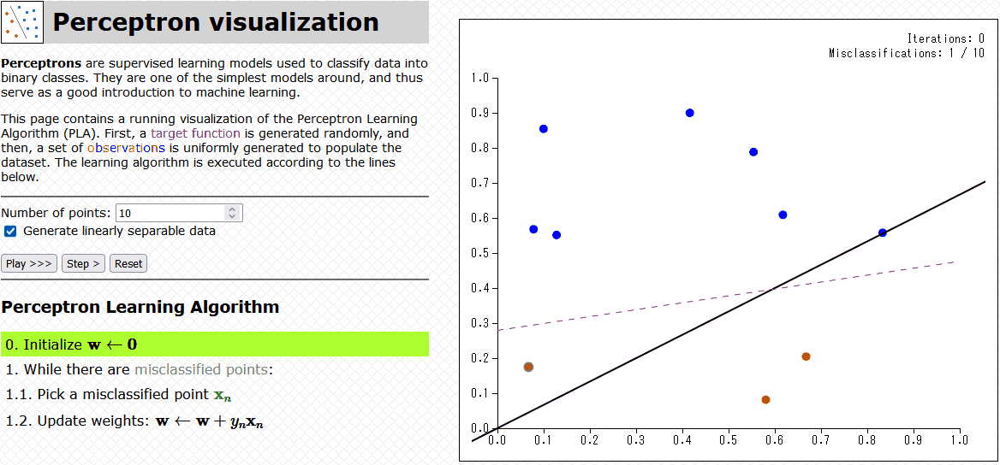

# perceptron-viz

[Click here to access the page!](https://vgarciasc.github.io/perceptron-viz/)

## What is it?

A web visualization tool that illustrates how the **Perceptron Learning Algorithm** (PLA) works. To the best of my knowledge, this is the only page available online where you can:

1. Advance the algorithm step-by-step;
2. Watch the model evolve over time;
3. Change the size of the dataset, as well as its linearity.

With these features, students can toy with the parameters and attain an intuitive feel for how the algorithm works.

If this was useful for you, feel free to star the repo! :)

## Other info

This page was cobbled together using D3.js and jQuery. All bugs are my own.

Made as auxiliary material for the "Computational Intelligence 1" class offered by the Computation and Systems Engineering Department in 2022/1.
